# 问题一：RTSTRUCT 文件中存储的数据类型判定（边界点 vs 内部点）

## 1. 研究目的

在对医学影像中的器官轮廓进行进一步处理（如轮廓简化、相似度评估、点密度分析）之前，首先需要明确：

> **RTSTRUCT 文件中存储的是区域内部的所有点，还是仅存储区域的边界点？**

该判定将直接决定后续是否需要执行“边界提取”等预处理步骤。

---

## 2. 数据背景

研究对象为 DICOM RTSTRUCT 文件。  
RTSTRUCT 是放疗计划中用于存储人工或半自动勾画器官轮廓的标准格式。

---

## 3. 方法

使用 Python 结合 `pydicom` 库读取 RTSTRUCT 文件，检查与轮廓定义直接相关的关键字段，包括：

- `ContourGeometricType`
- `NumberOfContourPoints`
- `ContourData` 的存储结构与长度

---

## 4. 实现代码

```python
from pathlib import Path
import pydicom

# 查找 RTSTRUCT 文件
rtstruct_path = next(Path(r'd:\point_plotting_reserch').rglob('*.RTSTRUCT*.dcm'))

# 读取 DICOM
ds = pydicom.dcmread(str(rtstruct_path))

# 输出 ROI 列表
print("ROIs in this RTSTRUCT:")
for r in ds.StructureSetROISequence:
    print(f"  ROINumber={r.ROINumber}, ROIName={r.ROIName}")

# 读取第一个 ROI 的第一个轮廓
contour = ds.ROIContourSequence[0].ContourSequence[0]

# 输出关键字段
print("\nContour information:")
print("ContourGeometricType:", contour.ContourGeometricType)
print("NumberOfContourPoints:", contour.NumberOfContourPoints)
print("len(ContourData):", len(contour.ContourData))
```

## 5.输出结果
```
(.venv) PS D:\point_plotting_reserch\src> python check_edge_points.py
ROIs in this RTSTRUCT:
  ROINumber=1, ROIName=Prostate
  ROINumber=2, ROIName=Lesion 1

Contour information:
  ContourGeometricType: CLOSED_PLANAR
  NumberOfContourPoints: 308
  len(ContourData): 924
```
len是NumberOfContourPoints的三倍，每个点有x，y，z三个坐标，证明该数据只有轮廓

---

# 问题二：最小边界点数的确定

**（轮廓简化与相似度评估）**

---

## 1. 研究目的

在确认 RTSTRUCT 文件中存储的是器官 **边界点** 之后，进一步关注的问题是：

> **在保证轮廓几何形状与原始轮廓高度一致的前提下，最少需要多少个边界点？**

明确最小有效边界点数有助于：

* 减少轮廓数据规模
* 提高几何计算与后续分析效率
* 为多病例统计分析提供统一的轮廓表示方式

---

## 2. 方法概述

### 2.1 原始轮廓

* **数据来源**：DICOM RTSTRUCT
* **研究 ROI**：Prostate
* **原始轮廓点数**：308
* **轮廓类型**：`CLOSED_PLANAR`（闭合平面轮廓）

---

### 2.2 轮廓简化策略

将原始轮廓视为一条 **闭合折线**，沿轮廓弧长方向进行 **等距离重采样**，生成不同点数的简化轮廓。

本实验中测试的目标点数包括：

```yaml
16
32
48
64
128
256
```

---

### 2.3 相似度评价指标

为定量比较简化后轮廓与原始轮廓之间的几何差异，采用以下两种 **互补指标**：

#### （1）面积相对误差（Area Relative Error）

$\text{Area Error} =
\frac{|\text{Area}_{simplified} - \text{Area}_{original}|}
{\text{Area}_{original}}$


用于衡量简化后轮廓在 **整体形状与尺度** 上的保持程度。

---

#### （2）Hausdorff 距离

Hausdorff 距离衡量两条轮廓曲线之间的 **最大局部偏差**，定义为：

$d_H(A, B) = \max \left(
\sup_{a \in A} \inf_{b \in B} \|a - b\|,
\sup_{b \in B} \inf_{a \in A} \|b - a\|
\right)$


该指标对局部几何误差高度敏感，单位为 **毫米（mm）**。

---

### 2.4 可接受误差阈值

根据医学影像几何精度需求，设定如下经验阈值：

| 指标           | 阈值       |
| ------------ | -------- |
| 面积相对误差       | ≤ 1.0 %  |
| Hausdorff 距离 | ≤ 0.5 mm |

当简化轮廓 **同时满足** 上述两个条件时，认为其与原始轮廓在几何上 **等价**。

---

## 3. 实验结果

程序运行输出如下：

```text
pts | area_err(%) | hausdorff(mm)
----------------------------------
 16 |    2.417 |        1.199
 32 |    1.314 |        0.991
 48 |    0.767 |        0.464
 64 |    0.214 |        0.367
128 |    0.234 |        0.256
256 |    0.022 |        0.129
```

程序自动判定结果：

```text
Minimal acceptable points = 48
(area_err ≤ 1.0%, Hausdorff ≤ 0.5 mm)
```

---

## 4. 结果分析

### 点数较少（16、32）时

* 面积误差和 Hausdorff 距离均明显超出阈值
* 轮廓在整体和局部几何上存在显著失真

---

### 点数达到 48 时

* 面积相对误差首次低于 **1%**
* Hausdorff 距离首次低于 **0.5 mm**

表明简化轮廓在 **全局与局部形态** 上均与原始轮廓高度一致。

---

### 点数继续增加（64、128、256）

* 几何误差进一步减小
* 误差下降幅度逐渐减弱
* 呈现明显的 **边际收益递减** 现象

---

## 5. 可视化结果

下图展示了原始轮廓与不同点数简化轮廓之间的对比结果：

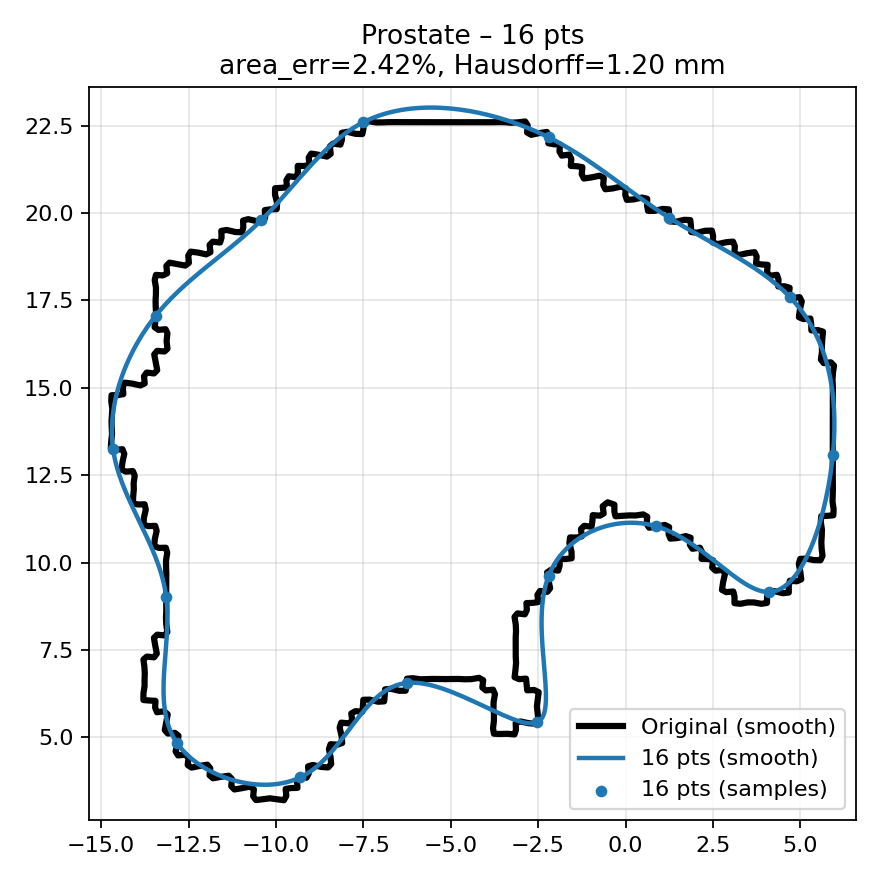
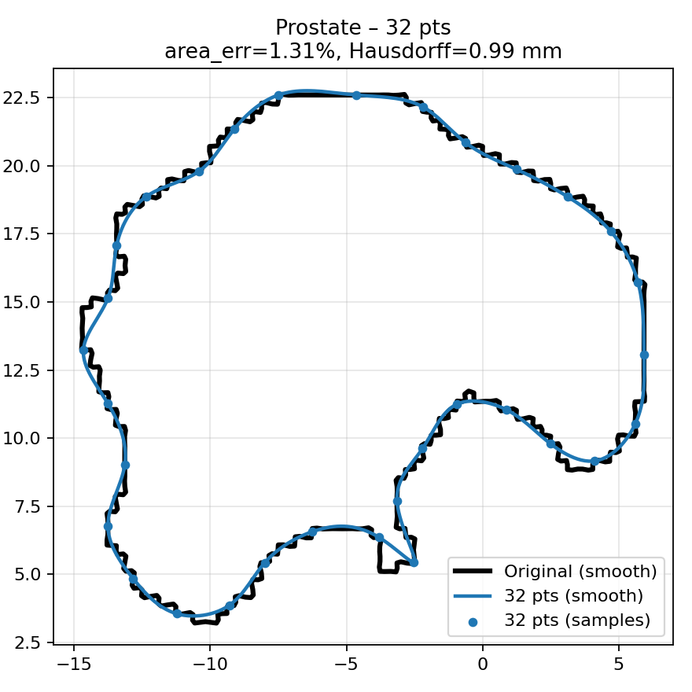

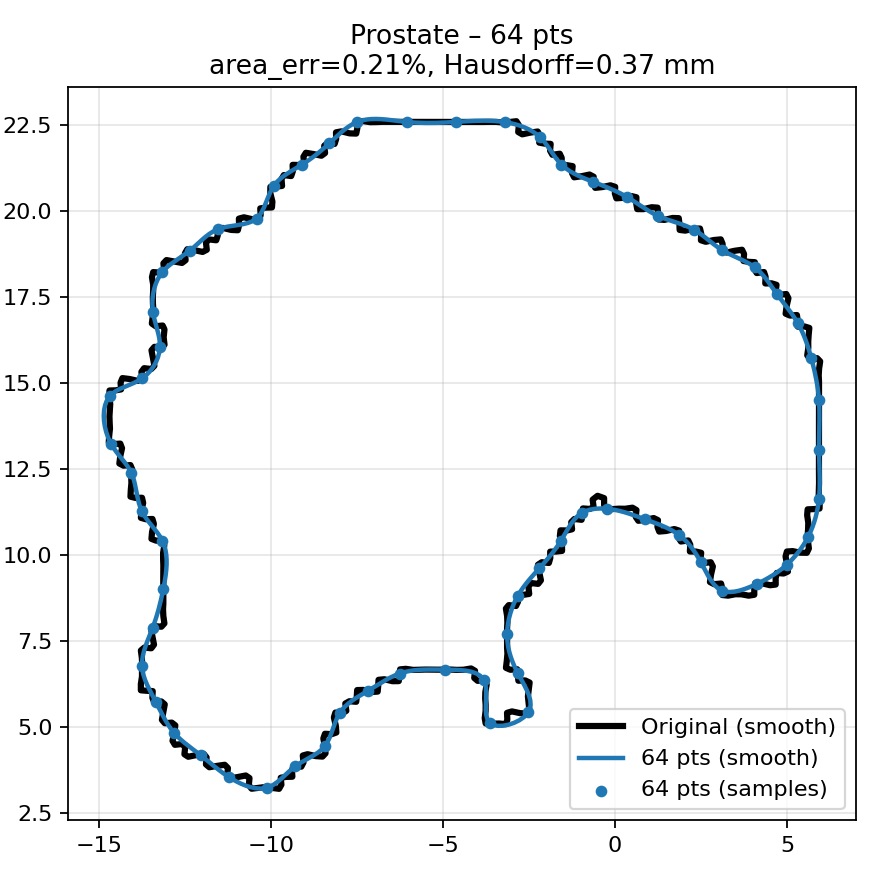
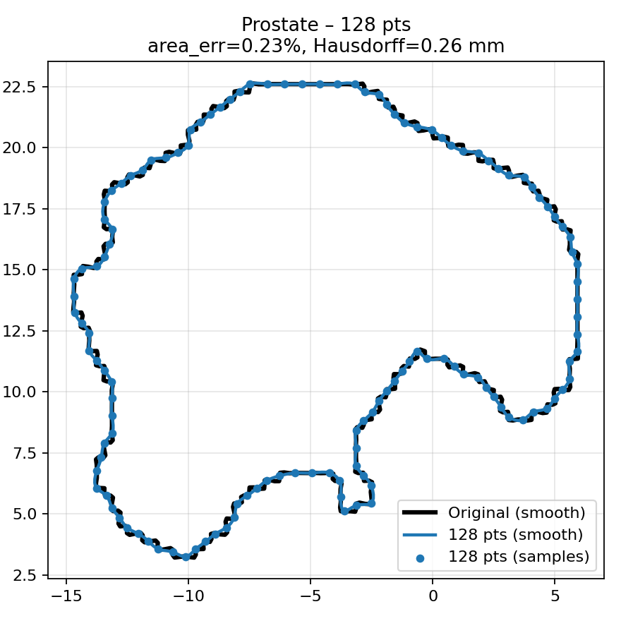
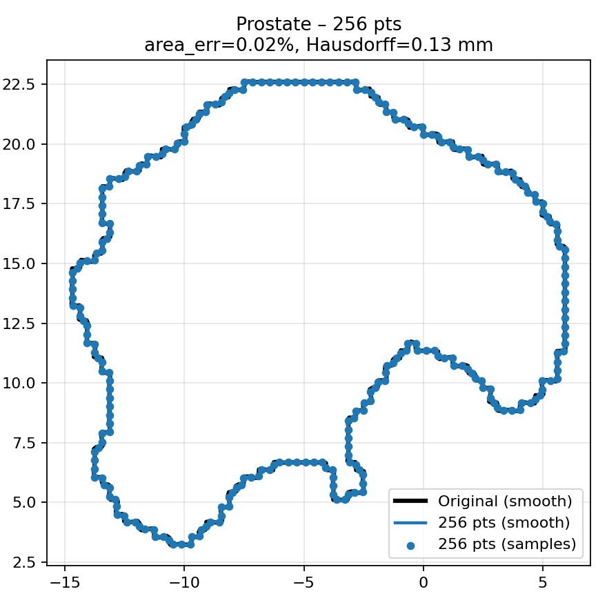

**注：**

* 所有几何误差计算均基于真实轮廓折线
* 平滑曲线仅用于可视化展示，不参与误差计算

---

## 6. 结论

* 轮廓简化后，几何误差随点数增加而 **单调下降**
* 在本实验设定的误差阈值下：

> **48 个边界点是保持轮廓几何相似性的最小可接受点数**

---

# 问题三：基于边界几何复杂度的自适应采样策略研究  
（边界点密集性与轮廓重建质量分析）

---

## 1. 研究动机

前述实验已确认：

- RTSTRUCT 文件中仅存储器官**边界点**
- 对前列腺轮廓而言，**48 个等距边界点**即可在**面积误差**与 **Hausdorff 距离**意义下与原始轮廓几何等价

然而，**等弧长重采样方法**隐含了一个关键假设：

> **轮廓各处的几何复杂度是均匀的**

这一假设在实际医学器官中并不成立。真实器官轮廓通常同时包含：

- **高曲率区域**：边界转折剧烈  
- **低曲率区域**：近似直线或缓慢变化  

若在所有位置均匀分配边界点，将导致：

- 在平滑区域**浪费点数**
- 在复杂区域**点数不足**，引起局部形态失真

因此，本节关注的核心问题是：

> **是否可以通过边界点的非均匀分布，在相同点数下更好地重建真实轮廓？**

---

## 2. 方法概述

### 2.1 基本思想

将原始轮廓视为一条**闭合边界曲线**，依据其**局部几何复杂度**（如转折、弯曲程度）自适应分配边界点：

- 高几何复杂度区域 → **边界点密集**
- 低几何复杂度区域 → **边界点稀疏**

在**总点数固定**的前提下，目标是：

- 最大限度保留局部几何特征
- 减小最大边界偏移（Hausdorff 距离）

---

### 2.2 自适应采样策略

具体实现流程如下：

1. 对原始边界进行**高分辨率参数化表示**
2. 估计边界上的**局部几何变化程度**（如转折强度）
3. 构造一条沿边界的**非均匀累积分布函数**
4. 在该分布上进行**等分采样**，生成目标点数的边界点

该策略本质上实现了：

点密度与边界几何复杂度成正比，即  
$\text{点密度} \propto \text{边界几何复杂度}$


---

## 3. 平滑轮廓构造方式说明（技术细节）

为避免简化后轮廓出现锯齿或不自然的折线连接，在自适应采样点基础上引入平滑曲线构造。

本文尝试了两种平滑方式：

- **全局 Spline 平滑**
- **局部 Chaikin 细分平滑**

需要强调的是：

> **平滑方法并非本节研究核心，仅用于验证“点分布方式”对轮廓重建质量的影响。**

---

## 4. 实验结果

在相同自适应采样点数条件下，计算简化轮廓与原始轮廓之间的：

- **面积相对误差**
- **Hausdorff 距离**

---

### 4.1 基于全局 Spline 平滑的结果

| pts | area_err (%) | Hausdorff (mm) |
|-----|--------------|----------------|
| 16  | 4.020        | 4.063          |
| 32  | 0.912        | 3.112          |
| 48  | 0.501        | 2.534          |
| 64  | 0.372        | 2.500          |
| 128 | 0.026        | 2.202          |
| 256 | 0.027        | 2.154          |

---

### 4.2 基于局部 Chaikin 平滑的结果

| pts | area_err (%) | Hausdorff (mm) |
|-----|--------------|----------------|
| 16  | 3.546        | 3.797          |
| 32  | 1.163        | 2.825          |
| 48  | 0.268        | 2.401          |
| 64  | 0.531        | 2.193          |
| 128 | 0.141        | 1.508          |
| 256 | 0.043        | 0.987          |


---

## 5. 结果分析：点分布比“曲线形式”更关键

### 5.1 主要观察结论

尽管采用了不同的平滑曲线构造方式，实验结果呈现出一致趋势：

- 在**相同点数**下  
- 自适应采样得到的轮廓：
  - 面积误差始终维持在较低水平
  - Hausdorff 距离随点数增加稳定下降


---

### 5.2 Hausdorff 距离显著改善的原因

Hausdorff 距离度量的是：

> 两条轮廓之间的**最大局部偏移**

在**等弧长采样**中：

- 低曲率区域被过度采样
- 高曲率区域点数不足
- 导致局部轮廓外扩或内缩

而在**自适应采样**中：

- 高曲率区域被密集采样
- 边界最大偏移被有效约束
- 从而显著降低 Hausdorff 距离

---

## 6. 可视化结果说明

下图展示了自适应采样下，不同点数轮廓的边界点分布特征：

- **高转折区域**：点明显密集  
- **平直区域**：点明显稀疏  
- **整体轮廓形态**：与原始边界高度一致  

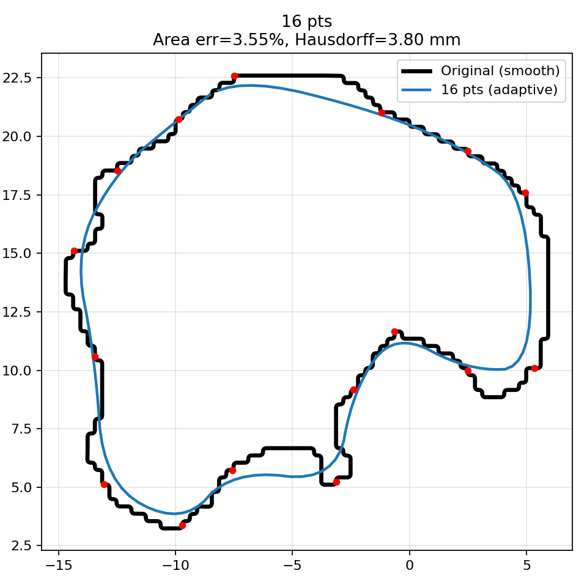
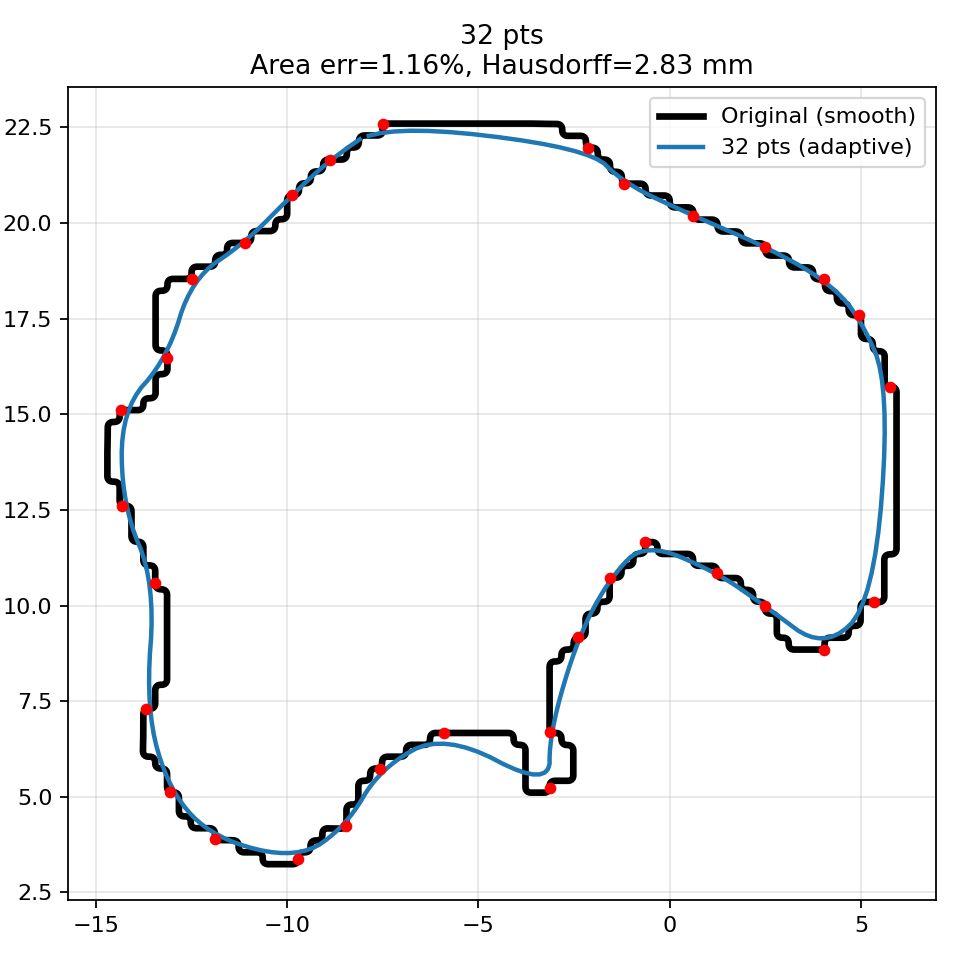
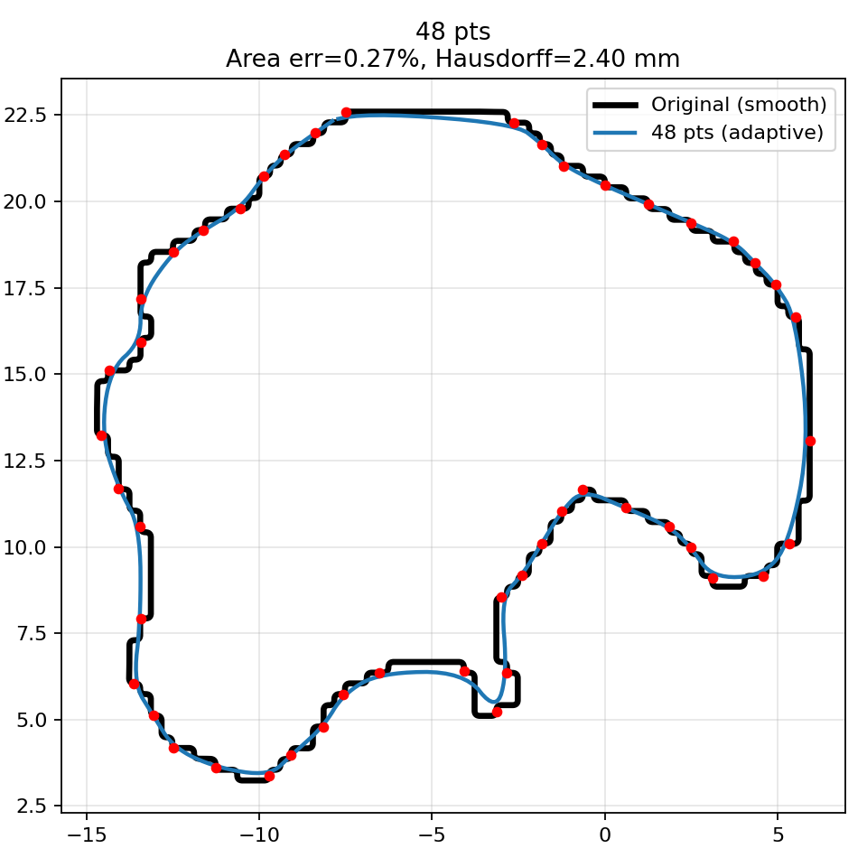
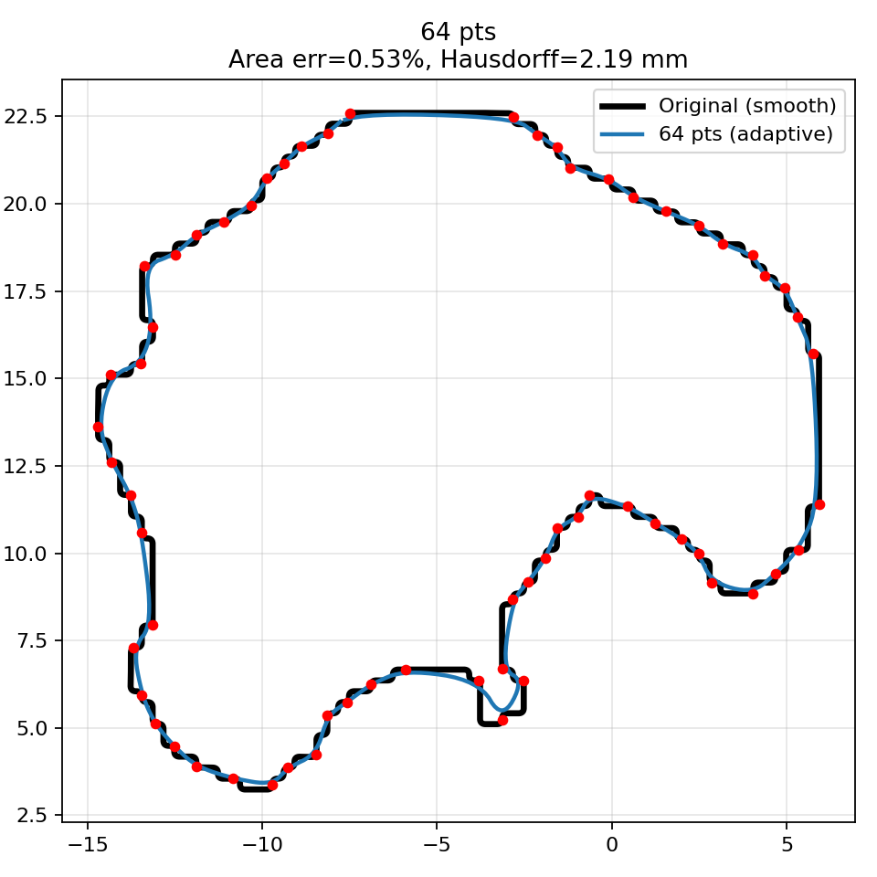
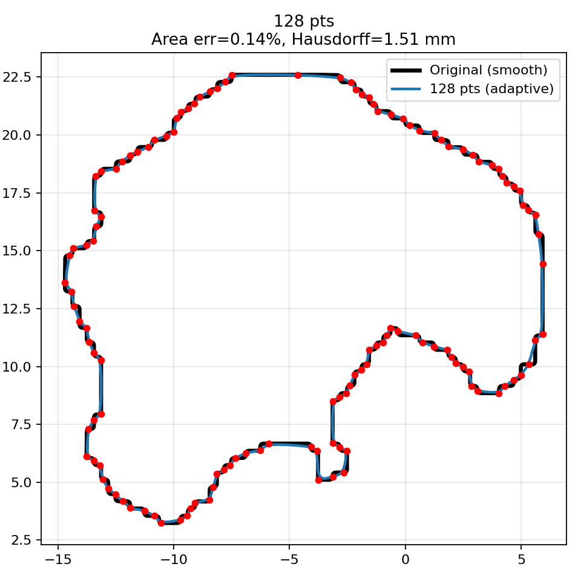
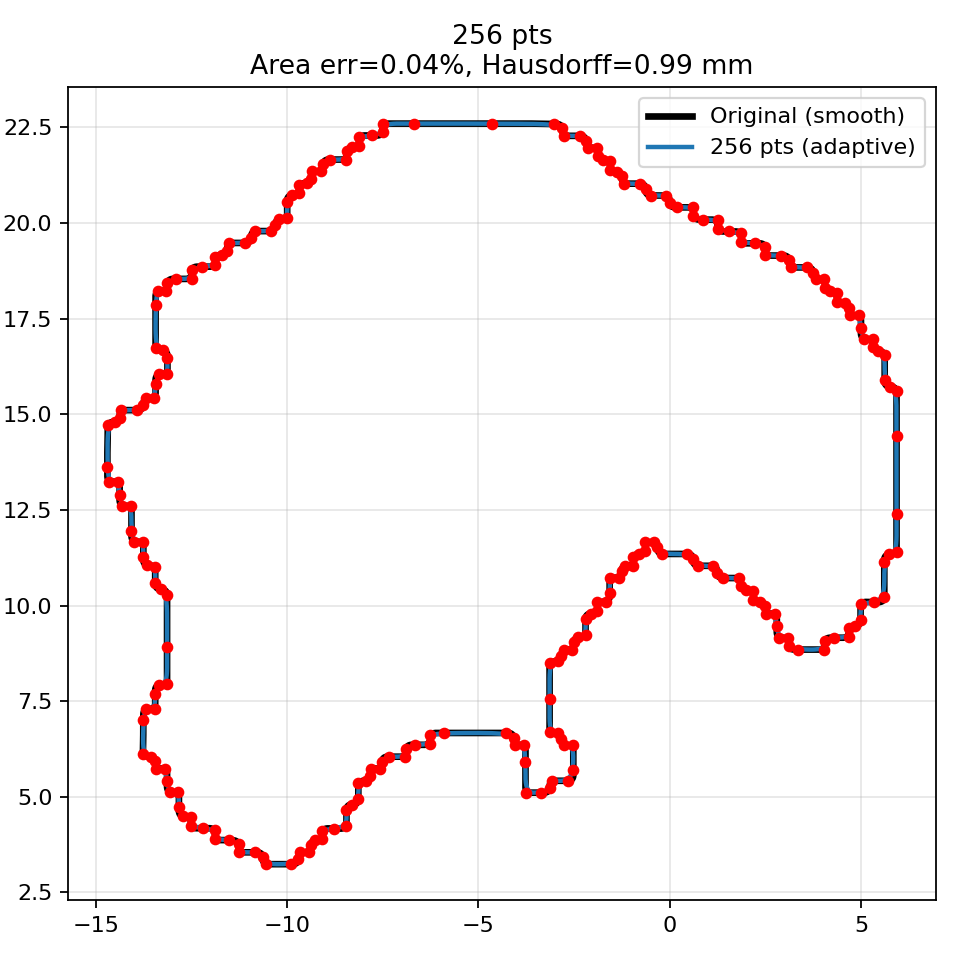


---

## 7. 本节结论

- RTSTRUCT 边界点具有明显的**几何复杂度不均匀特征**
- 基于边界几何复杂度的**自适应采样**：
  - 在相同点数下优于等距采样
  - 显著降低局部最大几何误差（Hausdorff 距离）
- **平滑曲线方法仅影响视觉表现，而非核心几何一致性**

---
