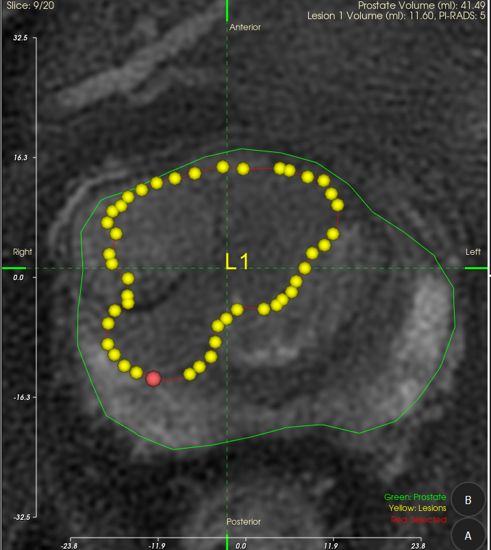

# Supplement: Key Algorithm Notes for `rtstruct_to_model_xml_adaptive.py`

This document supplements this week’s work in `src/rtstruct_to_model_xml_adaptive.py`, focusing on: adaptive point sampling, metric-threshold search (auto-finding the minimum point count), and Fusion-like coordinate conversion.

## 0. End-to-end pipeline (RTSTRUCT -> model.xml)

1. Read RTSTRUCT: `load_rtstruct_rois(RTSTRUCT_PATH)`
2. Read the referenced image series (when `COORD_MODE="fusion_like"`): `collect_image_slices(IMAGE_ROOT)`, and build a `SOPInstanceUID -> slice index/info` mapping
3. For each ROI contour:
   - `contour_xyz_to_model_xy_worldz()`: map contour physical coordinates `(x, y, z)` to model coordinates `(x, y)` + `world_z`
   - `sample_contour_for_export()`: compress/fit contour points based on the selected policy
   - Write XML: `build_model_xml()`, output to `outputs_model_xml_test/model.xml`

## 1. `POINT_POLICY="metric_threshold"`: auto-search the minimum point count

Goal: for each contour, automatically find the minimum `n` such that the exported curve satisfies:

- relative area error: `area_diff <= AREA_DIFF_TOL`
- Hausdorff distance (mm): `hausdorff <= HAUSDORFF_TOL`

Main implementation: `_sample_by_metric_threshold(xy)`

### 1.1 Search procedure

- Input: original 2D contour points `xy` (ordered points of a closed contour)
- Pre-compute: `area_orig = polygon_area(xy)` (with `max(area_orig, 1e-12)` to avoid divide-by-zero)
- Search upper bound:
  - `max_n = n_orig` (default)
  - if `METRIC_MAX_POINTS` is set: `max_n = min(n_orig, METRIC_MAX_POINTS)`
- Try `n = MIN_POINTS ... max_n`:
  - `curve = _build_export_curve_from_n(xy, n)`
  - `area_diff = abs(area(curve) - area_orig) / area_orig`
  - `h = hausdorff_polyline(xy, curve)`
  - if both `area_diff` and `h` meet thresholds, return `curve`

### 1.2 If no `n` meets the thresholds

Fallback is controlled by `METRIC_NO_MATCH_STRATEGY`:

- `ratio`: fall back to `n = round(n_orig * RATIO)`
- `fixed_points`: fall back to `n = FIXED_POINTS`
- `max_points` (default): return the curve using the largest `n` in the search range (usually “keep as many points as allowed”)

## 2. Adaptive resampling: `resample_adaptive_polyline()` (curvature-weighted)

Purpose: under the same point budget, allocate more samples to higher-curvature regions (typically easier to control Hausdorff).

Key steps:

1. Compute discrete curvature (turn angle) at each vertex `theta_i`: `discrete_curvature(points)`
2. Map vertex curvature to edge curvature (average of the two adjacent vertices):
   - `edge_curv_i = 0.5 * (theta_i + theta_{i+1})`
3. Edge weight (curvature-weighted “perimeter”):
   - `weight_i = seg_len_i * (1 + CURVATURE_ALPHA * edge_curv_i)`
4. Normalize cumulative weights `cum_w` to `[0, 1)`, then for `targets = linspace(0, 1, n, endpoint=False)` do `searchsorted + linear interpolation` to obtain `n` sampled points

Intuition: where `edge_curv` is larger, the edge gets a larger interval on `[0, 1)`, so sampling is denser around bends automatically.

## 3. Exported curve form: `EXPORT_MODE`

The exported curve is determined by `_build_export_curve_from_n()`:

- `EXPORT_MODE="adaptive_raw"`: export the points from `resample_adaptive_polyline()` directly (control polyline)
- `EXPORT_MODE="adaptive_fit_dense"`: sample control points first, then apply `fit_closed_bspline_curve()` and export `FIT_DENSE_POINTS` dense points (smoother)

Note: in `metric_threshold` search, both area error and Hausdorff are computed on the **final exported curve**, so `EXPORT_MODE` directly affects the minimum `n` found.

## 4. Hausdorff distance implementation (point-to-segment)

The script implements a point-to-segment Hausdorff distance (`hausdorff_polyline(a, b)`), rather than point-to-point:

- For each point in A, compute the minimum distance to all segments in B
- One-way Hausdorff = the maximum of these minimum distances
- Symmetric Hausdorff = `max(h(A, B), h(B, A))`

This is typically more stable when the two contours have different sampling densities.

## 5. Fusion-like coordinate conversion (`COORD_MODE="fusion_like"`)

### 5.1 Collecting the image series: `collect_image_slices()`

- Traverse `IMAGE_ROOT` for `*.dcm`, filtering out RTSTRUCT
- Read per-slice metadata: `SOPInstanceUID / IOP / IPP / PixelSpacing / Rows / Columns`
- Compute slice normal with `normal = cross(row_dir, col_dir)` and sort by `dot(IPP, normal)`
- Estimate slice spacing via the median of projected inter-slice distances (fallback to `SpacingBetweenSlices/SliceThickness`)
- Optionally set `world_origin` using a Fusion-like repositioning method (including `FUSION_ORIGIN_Y_OFFSET / FUSION_ORIGIN_Z_OFFSET`)

### 5.2 Converting contour points: `contour_xyz_to_model_xy_worldz()`

- Find the slice index using the contour’s `ReferencedSOPInstanceUID`
- `transform_physical_to_pixel_index()` projects a physical point to a pixel index (approximately ITK-style integer index)
- Convert to Fusion-like world coordinates:
  - `x = col_idx * sx + origin_x`
  - `y = (H - row_idx - 1) * sy + origin_y` (y-axis flip)
  - `world_z = (num_slices - slice_idx - 1) * slice_spacing + origin_z`

## 6. Tuning and visualization notes (this week)

The generated shapes under the two settings are very similar. I am still tuning thresholds/sampling behavior across different contours.

- Setting A: `POINT_POLICY="metric_threshold"`, `AREA_DIFF_TOL=0.1`, `HAUSDORFF_TOL=0.8`

- Setting B: `POINT_POLICY="metric_threshold"`, `AREA_DIFF_TOL=0.2`, `HAUSDORFF_TOL=1.0`

